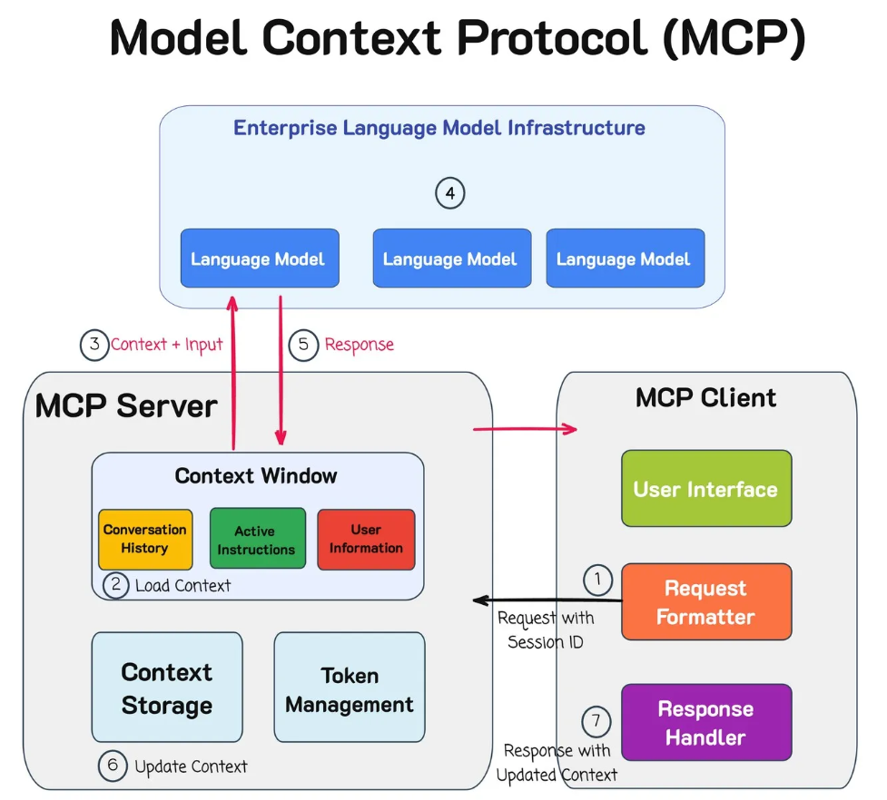
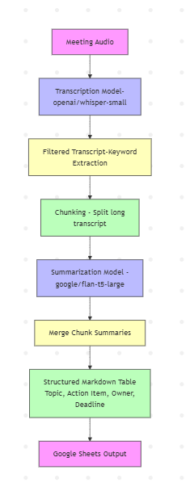

## 📌 Introduction

Meetings are a vital part of any organization, but capturing the key points, action items, and decisions can be tedious. What if you had an AI assistant that could **listen, summarize, and generate structured action tables automatically**?  

This is where **Model-Context-Protocol (MCP)** comes into play. MCP is a framework that allows multiple AI models to work together in a **structured, context-aware pipeline**, passing information seamlessly from one model to another. In this tutorial, we’ll build a **context-aware meeting assistant** using Hugging Face models that transcribes audio, summarizes discussions, and outputs a **ready-to-use table** with action items.  

---

## 📌 What is MCP?

**Model-Context-Protocol (MCP)** is an approach to orchestrate AI models:

- **Model:** The AI components (e.g., transcription model, summarization model).  
- **Context:** The information passed between models (e.g., meeting transcript).  
- **Protocol:** The structured rules for interaction (e.g., output format, table structure).  


In this tutorial, MCP works as follows:

1. **Transcription Model:** Converts meeting audio into text.  
2. **Summarization Model:** Consumes the transcript (context) and outputs structured tables.  
3. **Protocol:** Ensures the summarizer outputs **Markdown tables** with specific columns: *Topic, Discussion Summary, Decision, Action Item, Owner, Deadline, Notes*.  



---

## 📌 Step-by-Step Tutorial

The flowchart of step by step implementation of generic meeting audio is as follows:


### 🚀 Step 1: Install Dependencies

We’ll use Hugging Face Transformers for both transcription and summarization, along with `gspread` to save tables to Google Sheets.

```
*bash*
!pip install transformers torchaudio soundfile gspread gspread_dataframe pyarrow requests

```
---

### 🚀 Step 2 : Import Libraries and Authenticate Google Drive

```
*python*
import requests, re, math
from transformers import pipeline
from google.colab import auth
import gspread
from gspread_dataframe import set_with_dataframe
import pandas as pd

auth.authenticate_user()
gc = gspread.authorize(gspread.auth.default()[0])

```
---

### 🚀 Step 3 : Download Audio

```
*python*
audio_url = "YOUR_AUDIO_FILE_URL"
audio_file_path = "meeting_audio.mp3"

r = requests.get(audio_url)
with open(audio_file_path, "wb") as f:
    f.write(r.content)

print("✅ Audio downloaded.")

```
---

### 🚀 Step 4 : Transcribe Audio (Model Choice)

We’ll use openai/whisper-small from Hugging Face for transcription:
  - Small but effective for general-purpose speech-to-text.
  - Converts audio to plain text efficiently.

```
*python*
transcriber = pipeline("automatic-speech-recognition", model="openai/whisper-small")
transcript = transcriber(audio_file_path)
meeting_text = transcript['text']
print("🗒️ Transcript length:", len(meeting_text))

```
---

### 🚀 Step 5 : Filter Relevant Sentences

Focus on sentences that likely contain actionable information.

```
*python*
keywords = ["agenda", "motion", "resolved", "action", "decision", "approve", "recommend"]
sentences = re.split(r'(?<=[.!?]) +', meeting_text)
relevant_sentences = [s for s in sentences if any(k.lower() in s.lower() for k in keywords)]
filtered_transcript = " ".join(relevant_sentences)
print("Filtered transcript preview:", filtered_transcript[:500])

```
---

### 🚀 Step 6 : Chunk Transcript

Long transcripts can truncate the LLM output. Chunk it:

```
*python*
max_chunk_length = 2000
num_chunks = math.ceil(len(filtered_transcript) / max_chunk_length)
chunks = [filtered_transcript[i*max_chunk_length:(i+1)*max_chunk_length] for i in range(num_chunks)]
```
---

### 🚀 Step 7 : Summarize Each Chunk into a Structured Table

We’ll use google/flan-t5-large:
  -Large LLM capable of following instructions.
  -Generates Markdown tables from text input.

  ```
*python*
summarizer = pipeline("text2text-generation", model="google/flan-t5-large", max_length=1024)
tables = []

for chunk in chunks:
    prompt = f"""
You are a context-aware meeting assistant.

Task:
1. Summarize the transcript chunk.
2. Focus only on agenda topics, action items, decisions, and responsible parties.
3. Output strictly in a Markdown table format.
4. Columns must be:
   Topic / Agenda Item | Discussion Summary | Decision / Resolution | Action Item | Owner / Responsible Person | Deadline | Notes
5. Do not include any text outside the table.

Transcript chunk:
{chunk}
"""
    summary = summarizer(prompt)[0]['generated_text']
    tables.append(summary)
```
---

### 🚀 Step 8 : Merge Tables and Convert to DataFrame

```
*python*
all_rows = []

for table_text in tables:
    lines = table_text.split('\n')
    start_idx = 0
    for i, line in enumerate(lines):
        if "Topic / Agenda Item" in line:
            start_idx = i
            break
    table_lines = lines[start_idx:]
    
    for line in table_lines[1:]:
        if line.strip() and "|" in line:
            row = [cell.strip() for cell in line.strip('|').split('|')]
            while len(row) < 7:  # fill missing columns
                row.append('')
            all_rows.append(row)

columns = ["Topic / Agenda Item", "Discussion Summary", "Decision / Resolution",
           "Action Item", "Owner / Responsible Person", "Deadline", "Notes"]
df = pd.DataFrame(all_rows, columns=columns)

# Auto-fill placeholders
df["Owner / Responsible Person"] = df["Owner / Responsible Person"].replace('', 'TBD')
df["Deadline"] = df["Deadline"].replace('', 'TBD')

print("📝 DataFrame preview:")
print(df.head(10))

```
---

### 🚀 Step 8 : Save to Google Sheets

```
*python*
sheet = gc.create("Meeting Summary (MCP Assistant)")
set_with_dataframe(sheet.sheet1, df)
print(f"✅ Table saved to Google Sheet: {sheet.url}")

```
---

## 📌 Why These Models?

  - <code>openai/whisper-small:</code> Lightweight transcription, supports multiple languages, good for quick deployment.
  - <code>google/flan-t5-large:</code> Instruction-following LLM ideal for structured summarization.
  - <code>Hugging Face pipelines:</code> Easy integration in Python/Colab, no API keys needed.

---
  
## 🏙️ Case Study: Springfield Council Meeting Audio

As a practical demo, we used a real municipal council meeting recording:

[🎧 Springfield Council Meeting (Aug 19, 2025)](https://springfield.municipalwebsites.ca/ckfinder/connector?command=Proxy&lang=en&type=Files&currentFolder=%2F&hash=c245c263ce0eced480effe66bbede6b4d46c15ae&fileName=Council%20Meeting%202025-08-19.mp3)

The model automatically:

    - Transcribed the entire session
    - Extracted agenda topics
    - Generated an action tracker table (auto-filled missing owners/deadlines)
    - Exported everything to Google Sheets

[Table from the Springfield meeting dataset](https://docs.google.com/spreadsheets/d/1-vwlDSXb-5pEBOw5MKPyyBE16GIZiUVoqcXMvWsuNKM/edit?gid=0#gid=0)

---

## 📈 What You Can Do Next

Once you have your AI meeting assistant running, you can extend it:

    - 🔔 Slack or Email integration: Auto-send summaries post-meeting.
    - 📅 Calendar sync: Generate follow-up reminders based on deadlines.
    - 🧩 Multi-Model MCP Server: Add emotion or speaker analysis for richer context.


---

## 📚 Further reading

    - [DataCamp’s MCP Tutorial](https://www.datacamp.com/tutorial/mcp-model-context-protocol)
    - [Hugging Face Models](https://huggingface.co/models)
    - [Overhearing LLM Agents: A Survey, Taxonomy, and Roadmap](https://arxiv.org/abs/2509.16325)
    
---

## 📌 Conclusion

By combining MCP, Hugging Face models, and structured prompts, you can build a context-aware AI meeting assistant that:

  - Listens to audio and transcribes it.
  - Filters relevant discussion points.
  - Summarizes into structured action tables.
  - Saves results to Google Sheets ready for collaboration.

This approach is scalable, adaptable, and fully automatable, and can serve as a foundation for more advanced applications like real-time assistant dashboards or team performance tracking.

---

Stay Focused 💯🚀🎯
